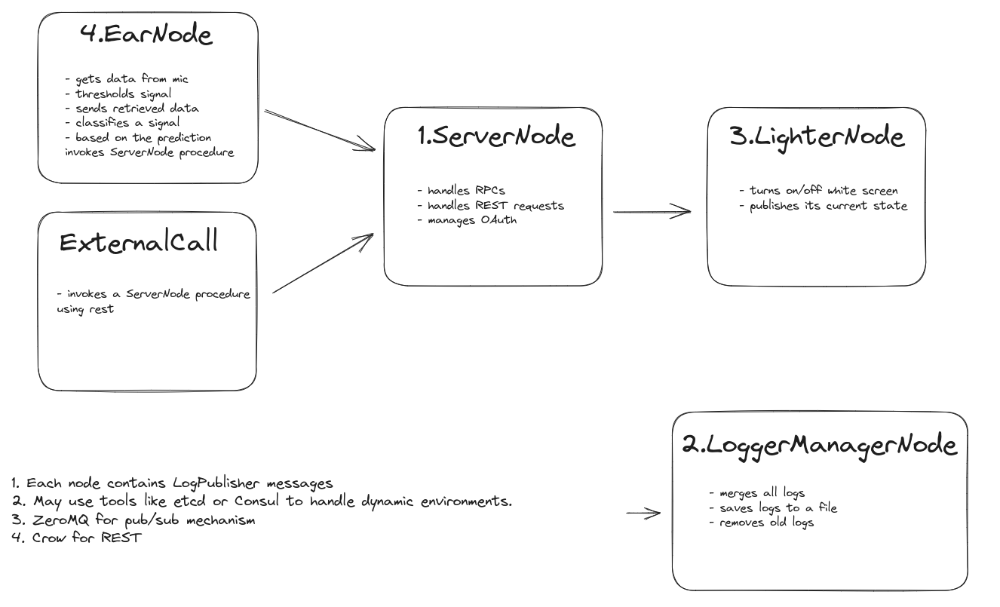

# MultiNodeLighter



## Technologies
- **C++17**
- **CMake**
- **gRPC**
- **Protobuf**
- **ZeroMQ**
- **Crow** - for Restful interaction

## Running
```bash
mkdir -p build
cd build
cmake ..
cmake --build . # replace . with path to build directory
```

